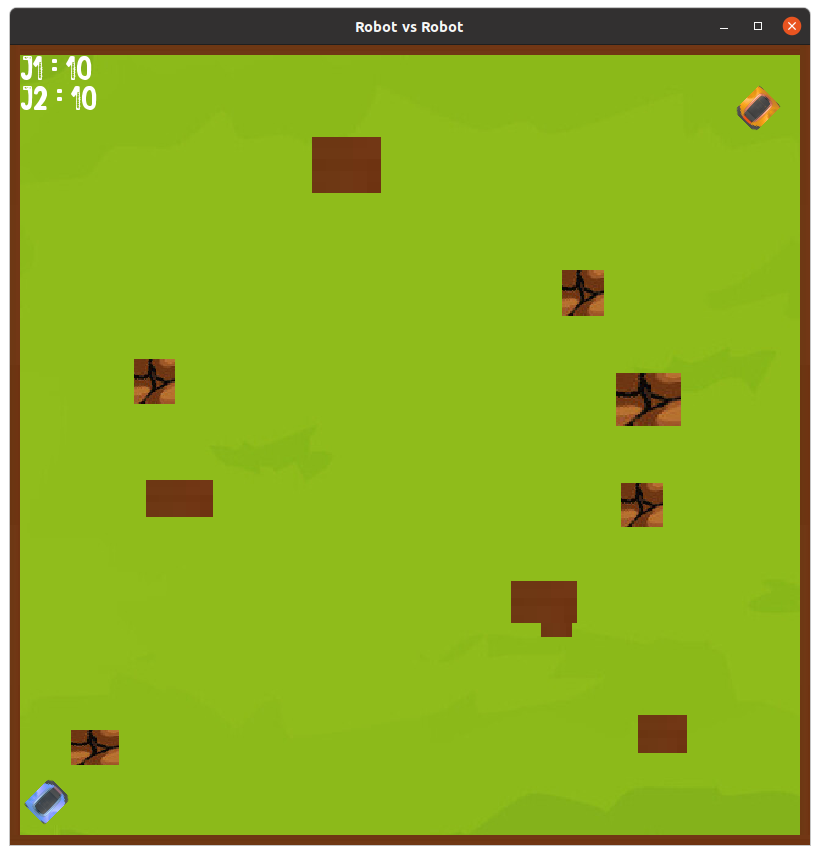

# ROBOT VS ROBOT

## Auteurs 
CHEVALIER Gaëtan, CORREAS Hugo

## Description 
Projet de Programmation Orientee Objet ayant pour but de créer un jeu 2D multijoueur.

9 classes dont 7 concrètes et 4 dérivées. 
*Diagramme UML : UML_0206.pdf*

Le placement des murs est fait aléatoirement, ce qui permet de jouer dans des environnements différents à chaque partie.

## Documentation doxygen
Ouvrir le fichier [html/index.html](html/index.html) dans un navigateur.

## Bibliothèques utilisées
- SFML : affichage et graphisme
- vector : gestion de tableau
- memory : utilisation de shared_ptr

## Objectif

Être le premier à amener les points de vie de l'adversaire à 0.

Les joueurs peuvent avancer, reculer, tourner et utiliser des armes.

Il existe deux types d'armes : 

* Les mines qui sont lâchées sur le sol et qui explosent lorsque l'autre joueur passe à proximité. Elles donnent 3 de dégâts.

* Les missiles qui sont tirés vers l'avant du robot et qui parcourent la carte jusqu'à rencontrer un obstacle (mur, robots, bords de l'écran). Ils donnent 1 de dégâts.
Les joueurs peuvent avoir au maximum 4 armes affichées à l'écran, il faut donc être vigilant et les utiliser de manière réfléchie sous peine de ne plus pouvoir tirer ! Si 4 mines sont déja sur le terrain, il n'est donc pas possible de tirer des missiles.

## Lancer une partie

- Si besoin, installer la bibliothèque SFML.
```bash
    sudo apt-get install libsfml-dev
```

- Se placer dans le dossier contenant les sources et éxécuter les commandes suivantes.
```bash
    make
```
```bash
    ./jeu
```
 
## Description de l'affichage

* Herbe = sol
* Mur plein = mur incassable
* Mur fissuré = mur cassable (1 point de vie)

Les points de vie (10 initialement) sont visibles en haut à gauche.

Le joueur 1 est en haut à droite et le joueur 2 est en bas à gauche


## Commandes 

### Joueur 1

- Avancer : &#8593;
- Reculer : &#8595;
- Tourner vers la droite : &#8594;
- Tourner vers la gauche : &#8592;
- Tirer un missile : &#109;
- Poser une mine : &#112;

### Joueur 2

- Avancer : &#122;
- Reculer : &#115;
- Tourner vers la droite : &#100;
- Tourner vers la gauche : &#113;
- Tirer un missile : &#101;
- Lâcher une mine : &#97;

Il est possible de maintenir enfoncées les touches lors du mouvement.

## Améliorations possibles
- Fluidité dans les déplacements des robots
- Ajout de musiques
- Présence de graphismes plus dynamiques

## Aperçu du jeu



